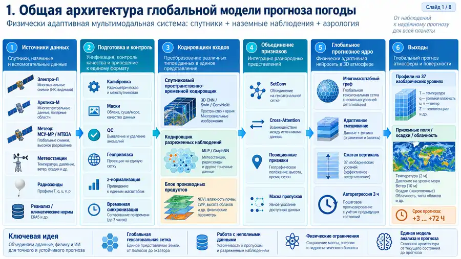

# global-ml-weather

Глобальная исследовательская модель погоды. Версия 0.6.0.

Модель использует разреженные атмосферные наблюдения за 12 часов и рассчитывает прогноз до 72 часов.
Выход содержит 37 изобарических уровней от 1000 до 1 гПа и приземные величины.
Внутренняя сетка охватывает Землю; маска выдачи не обрезает глобальную динамику.

**В репозитории нет весов с подтверждённой метеорологической точностью.**
Реальные статистики нормировки не являются весами погодной нейросети.
Аналитические тесты проверяют программу, а не точность погоды.

## Визуальное руководство



[Восемь схем от общей структуры до полного цикла](docs/ARCHITECTURE_VISUAL_GUIDE.md).
Статус блоков определяется кодом и технической документацией, а не только иллюстрациями.

## Что работает

Адаптивное ядро использует направленный граф, физические признаки состояния и сжатую вертикаль.
По умолчанию колонка содержит восемь скрытых позиций.
Геометрия — двойственная икосаэдрическая сетка с 12 пятиугольниками, не H3.
Станции и аэрологические профили могут быть неполными.

Многомодальная модель добавляет отдельные ResU-Net и ConvGRU для трёх потоков изображений.
МТВЗА использует спектральный MLP, GRU и явные пространственные связи пятна.
Станции и профили проходят локальное внимание.
Источники объединяются перед прогнозной динамикой.
Все ветви проверяются по градиентам и расчёту до 72 часов.

Работает цикл подготовленной выборки: проверка, нормы, обучение, продолжение, итоговый тест и прогноз по весам.
Смена данных, норм и численной среды проверяется перед продолжением.
Прогнозный режим не читает будущие цели.

Есть условные методы спутниковой продукции: индексы, облачные параметры, влажность почвы и температура поверхности.
Продукты имеют отдельные методы, нормы, возраст и происхождение.
Калибровка реального прибора не возникает от наличия формулы.

Реальные файлы норм GraphCast включены в `assets/normalization/graphcast`.
Глобальный DEM 30 угловых секунд скачан отдельно: 896166188 байт, меньше 900 МБ.
[Получение норм, скачивание DEM и подключение к обучению](docs/REFERENCE_DATA.md).

## Установить

Требования: Linux, отдельный Python 3.10+ и CPU-сборка PyTorch.
Не заменяйте системный Python Astra. Docker и Node.js для работы не нужны.
Сетевая установка требует разрешения оператора.

```bash
python3 -m venv .venv
. .venv/bin/activate
python -m pip install 'torch>=2.2,<3' --index-url https://download.pytorch.org/whl/cpu
python -m pip install -e '.[test,data,lab,ecosystem]'
python -m pytest -q
```

Для GeoTIFF нужен `rasterio`; для NetCDF и DEM нужны зависимости `data`.
Установщик `scripts/install-lab.sh` сохраняет режим `--offline`.
Он требует заранее подготовленного совместимого каталога пакетов.
Готовый комплект всех зависимостей в репозиторий не включён.

## Использовать реальные нормы

```bash
python -m global_weather.import_climatology --bundled --output data/normalization/graphcast-base.json
```

Команда работает без сети и проверяет хэши встроенных файлов.
В них указан период с 2 января 1979 года по 2015 год.
Конечный год принимается полностью, без выдуманной точной даты последнего измерения.

Базовые нормы включают приземное давление и облачность.
Точка росы, трёхчасовые осадки, спутниковые каналы и продукция требуют собственных статистик обучающей части.
Не используйте нормы воздуха для спутниковой яркостной температуры.

```bash
python -m global_weather.pipeline fit-norms --dataset data/prepared/unscaled.json --base data/normalization/graphcast-base.json --output data/prepared/normalized.json
```

Замените пример пути своей подготовленной выборкой.
Один атмосферный набор норм используется во входах, выходном преобразовании и ошибке обучения.
[Подробности нормировки](docs/NORMALIZATION.md).

## Получить рельеф

[Артефакт глобального DEM](https://github.com/f2re/global-ml-weather/actions/runs/37203926389/artifacts/11303707893).
Он содержит полный NetCDF, SHA256 и паспорт исходных 288 плиток.
Срок хранения заканчивается 2 января 2027 года; сохраните локальную копию.
Большой файл не хранится в истории Git.

Для авторизованного GitHub CLI:

```bash
gh run download 37203926389 --repo f2re/global-ml-weather --name global-dem-30s-under-900mb --dir data/dem
```

DEM имеет шаг 30 угловых секунд и упаковку 0,5 м.
Паспорт и проверенный размер находятся в `assets/dem/earth_relief_30s_p.json`.
Он содержит и батиметрию; отрицательная высота сама по себе не определяет море.

```bash
python -m global_weather.terrain --dem data/dem/earth_relief_30s_p.nc --manifest assets/dem/earth_relief_30s_p.json --reference-static data/prepared/static.npz --mesh-level 3 --confirm-landmask --output data/prepared/static-dem.npz
```

Команда требует независимые исходные статические поля и проверенную долю суши.
Размер сетки должен совпадать с выборкой.
На воде и в смешанных ячейках сохраняется исходная орография, а не глубина дна.
На подтверждённой суше сохраняются и отрицательные высоты.

Перенос пока выбирает ближайший центр DEM, а не среднее по площади ячейки.
Новый файл `static-dem.npz` включите в новый манифест и эксперимент.
Все три модели используют его высоты; большой DEM не читается на каждой эпохе.
[Ограничения масштаба и методы работы](docs/REFERENCE_DATA.md).

## Проверить многомодальную модель

```bash
python -m global_weather.multimodal selftest --output outputs/multimodal-check
python -m global_weather.multimodal demo-dataset --output outputs/multimodal-data --horizon-hours 6
python -m global_weather.pipeline train --dataset outputs/multimodal-data/dataset.json --config configs/train_smoke.json --output outputs/multimodal-training
```

Используйте новые каталоги.
Первая команда проверяет все ветви, сохранение весов и расчёт до 72 часов.
Вторая создаёт явно синтетический набор, а не спутниковый архив.
[Контракты кадров, нормы каналов и подготовка выборки](docs/MULTIMODAL.md).

## Проверить исходный цикл

```bash
python -m global_weather.pipeline demo-dataset --output outputs/example-data --horizon-hours 3
python -m global_weather.pipeline validate --dataset outputs/example-data/dataset.json
python -m global_weather.pipeline train --dataset outputs/example-data/dataset.json --config configs/train_smoke.json --output outputs/example-training
python -m global_weather.pipeline evaluate --dataset outputs/example-data/dataset.json --run outputs/example-training --output outputs/example-test.json
python -m global_weather.pipeline forecast --dataset outputs/example-data/dataset.json --run outputs/example-training --sample sample-4 --horizon-hours 3 --output outputs/example-forecast
```

Цели аналитического набора не получаются из выхода необученной сети.
Итоговый тест не участвует в выборе эпохи.
Для полного горизонта выполните `python scripts/pipeline-test.py`.
[Подготовка реальных целей и продолжение обучения](docs/TRAINING.md).

## Подключить существующие проекты

| Источник | Реализованный вход | Ограничение |
|---|---|---|
| `arktika-worker` | `product.json`, `values.tif`, `quality.tif` | ИК-каналы без повторной шкалы |
| GPTL | Локальный L2IR, метаданные и `.download.json` | Нужны подтверждённые канал, время и геометрия |
| SatDump `release/1.2.2` | `dataset.json`, `product.cbor`, каналы | Контейнер не подтверждает радиометрию |
| Станции и аэрология | Физические сообщения JSONL | Маски и время доступности сохраняются |
| ERA5 | Локальный CF-NetCDF | Цели и нормы, не заполнение отсутствующих наблюдений |

Ревизии поставщиков закреплены в `configs/ecosystem_sources.json`.
Проверка исходника не удостоверяет установленный бинарный файл SatDump.
МТВЗА требует физической калибровки, таблицы каналов и подтверждённой антенной поддержки.
Исходные каталоги, журналы и службы поставщиков не изменяются.

```bash
python -m global_weather.compatibility satdump /path/to/output/dataset.json --require msu_mr mtvza
```

Замените путь фактическим каталогом.
[Совместимость](docs/ECOSYSTEM.md) и [коннекторы](docs/CONNECTORS.md) описывают уровни допуска.

## Спутниковая продукция

```bash
python -m global_weather.products catalog
python -m global_weather.products calculate --job data/job.json --output data/product.npz
python -m global_weather.products export --product data/product.npz --geometry data/geometry.npz --output data/products.jsonl --registry-output data/product-registry.json
```

Подготовьте физические входы и задание по [руководству продукции](docs/SATELLITE_PRODUCTS.md).
NDVI и NDMI не являются объёмной влажностью почвы.
LWP требует оптической толщины, радиуса и жидкой фазы.
Инверсия почвы требует проверенной приборной таблицы.
Непригодный продукт остаётся маской, а не физическим нулём.
Отдельная страница расчёта продукции пока не добавлена.

## Интерфейс и агенты

```bash
python -m global_weather.pipeline demo-dataset --output outputs/lab/datasets/demo --horizon-hours 3
python -m global_weather.lab.app --workspace outputs/lab --port 8765
```

Откройте `http://127.0.0.1:8765/training` для работы с выборкой.
Основная страница показывает сферу, профили, очередь и диагностики.
Оба интерфейса используют одного исполнителя.
Не публикуйте стенд в интернет без отдельной системы доступа.

Веб-пределы остаются прежними: 162 ячейки, 16 примеров, пять эпох.
Для более крупного исследования используйте CLI и отдельный бюджет ресурсов.
Большой DEM готовится до загрузки в стенд; из браузера он не скачивается.

Девять ролей имеют инструкции в `agents/` и определения в `.claude/agents/`.
Применяйте OPS, TRAIN, PRODUCTS и MULTIMODAL в соответствующих задачах.
[Указатель обязательных протоколов](docs/protocols/README.md).
Документация использует русский профиль `RU-TECH-1`.
Диспетчер действий не является автономной группой языковых моделей.

## Проверки и границы

```bash
python -m pytest -q
python scripts/products-test.py
python scripts/pipeline-test.py
python -m global_weather.multimodal selftest --output outputs/multimodal-verification
python scripts/check_docs.py --strict
```

Браузерные проверки требуют Playwright и Chromium.
Сохранены `scripts/browser-test.py` и `scripts/pipeline-browser-test.py`.
Сверяйте результаты с итоговым коммитом.

Не заявлены калибровка реальных проходов, полный водно-энергетический бюджет и многосезонная точность.
Строковое время спутникового сканирования и динамические поверхность, снег и лёд требуют дальнейшей разработки.
Наличие их статистик не означает реализацию соответствующих прогнозных уравнений.

[Архитектура](docs/ARCHITECTURE.md) · [Данные](docs/DATA_CONTRACT.md) ·
[Многомодальные адаптеры](docs/MULTIMODAL.md) · [Справочные данные](docs/REFERENCE_DATA.md) ·
[План](docs/ROADMAP.md).
