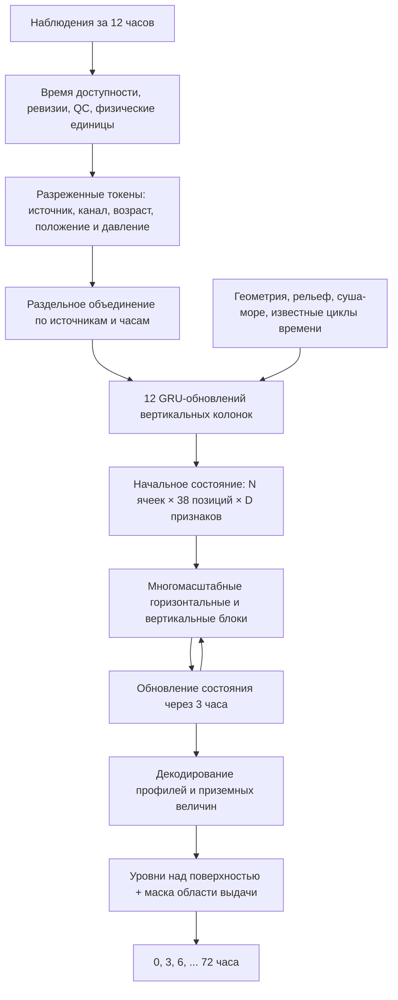

# Архитектура: сферическая сетка, профили и 72 часа

## Постановка

Оперативные входы: доступные к моменту выпуска t наземные и аэрологические
измерения за (t−12 ч,t], почасовые каналы «Электро-Л» и «Арктики-М», отдельные
проходы МСУ-МР и МТВЗА. Орбитальные проходы не размножаются по часам.
Реанализ допустим для целей и предварительного обучения, но не подменяет
отсутствующие наблюдения в оперативном входе.

«Все профили» здесь означает профиль переменных на выбранных стандартных
изобарических поверхностях. Это **не** подстановка неизменной стандартной
атмосферы ISA и не обещание восстановить каждую деталь непрерывной атмосферы.
Приняты 37 уровней ERA5 от 1000 до 1 гПа [S3]. Не заявлены 137 нативных
гибридных уровней, вся атмосфера до космических высот или точное восстановление
неизмеренных величин. В следующем варианте ядро может работать на гибридных
уровнях с интерполяцией продукции на стандартные изобары.

## Геометрия

Рассматривалась H3 [S1–S2]. Для первой реализации выбран собственный двойственный
икосаэдрический граф: исходный икосаэдр, деление каждой треугольной грани на
четыре и нормирование новых вершин на сферу. Вокруг узлов строятся сферические
ячейки Вороного средствами SciPy [S4]. Они имеют 5 или 6 соседей; пятиугольников
всегда 12. Нет шва на 180° и вырождающихся прямоугольных ячеек у полюсов.

Число ячеек N=10·4^r+2 следует из 20·4^r треугольников и формулы Эйлера.

| Уровень r | Ячеек | sqrt(средней площади), примерно |
|---|---:|---:|
| 1 | 42 | 3485 км |
| 3 | 642 | 891 км |
| 5 | 10 242 | 223 км |
| 6 | 40 962 | 112 км |
| 7 | 163 842 | 56 км |
| 8 | 655 362 | 28 км |

Последняя колонка — вычисленная характеристика площади, **не** постоянный шаг,
не диаметр гексагона и не эффективное разрешение прогноза. Уровень 1 служит
только проверке исполнения. Размеры H3 имеют другую нумерацию и сюда неприменимы.

Площади ячеек различаются. В функции потерь используется площадь каждой ячейки.
Переходы между масштабами агрегируют признаки по ближайшему крупному центру с
весами площадей. Это алгебраическая иерархия, **не** строго вложенные полигоны
и **не** консервативное пересечение ячеек. Она не обеспечивает сохранение воды
или энергии сама по себе. Для физических потоков нужен отдельный оператор.

Ветер декодируется через касательный вектор в декартовой системе Земли, затем
переводится в восточную и северную компоненты. В самой точке полюса выбор
направления «восток» условен; декартово касательное представление сохраняется
однозначным. Сеть не объявляется строго вращательно-эквивариантной.

## Схема реализованного варианта

38 позиций — 37 изобар плюс отдельная поверхность. В примере D=16, настраивается
из командной строки. В расчёте с r=1 два пространственных масштаба: 42 и 12
ячеек. Для исследовательской рабочей конфигурации предлагается D=96–128 и более
подробная глобальная сетка, после измерения памяти и качества на меньшей задаче.

| Блок | Реализация 0.1 |
|---|---|
| Измерение | MLP из 12 численных признаков + обучаемые обозначения величины и источника |
| Наземные данные | Поверхностная позиция колонки, отдельные скалярные измерения |
| Аэрология | Две соседние изобары, веса по log(p), без вертикальной экстраполяции |
| Радиансы | Признак колонки и обучаемый вертикальный затвор; не готовый профиль температуры |
| Время | 12 GRU-обновлений, только для имеющих входы позиций |
| Горизонталь | Сообщения соседей на нескольких глобальных масштабах |
| Вертикаль | Разделённая свёртка по колонке + признаки log(p) и поверхности |
| Динамика | Остаточное обновление скрытого состояния фиксированным шагом |
| Выход | Независимые модули для профилей и поверхности |

Входные скаляры агрегируются в пределах ячейки и часа. Это теряет часть
внутриячеечной структуры. Полноценные пространственно-временные кодировщики
многоканальных снимков, локальное внимание по исходным пикселям и антенная
геометрия МТВЗА ещё не реализованы. Их нельзя считать заменёнными этим MLP.

Первые 12 часов используются только при восстановлении исходного состояния.
В расчёт выпуска t не подмешиваются реальные наблюдения t+1,...,t+72.
Новый пакет наблюдений запускает отдельный новый выпуск.

## Что прогнозируется

| Группа | Величины | Ограничения |
|---|---|---|
| 37 изобар | T [K], q [kg/kg], u/v [m/s], Φ [m²/s²], omega [Pa/s] | Маска p≤ps; omega не равна вертикальной скорости в m/s |
| Поверхность | T2, Td2, u10/v10, ps, MSLP | Давление станции и MSLP не смешиваются; Td2≤T2 |
| Осадки | Количество за (предыдущий срок, текущий срок] [kg/m²] | Не мгновенная интенсивность; в анализе t осадки за прогнозный шаг отсутствуют |
| Облачность | Общая доля [0,1] | Только при наличии согласованной разметки; не автоматическая балльность по станции |

Высоту Φ/g, скорость и направление ветра, плотность, точку росы и относительную
влажность на уровнях следует получать диагностически с явными формулами,
фазой насыщения и областью применимости. В 0.1 для них нет отдельного продукта.
Не вводятся самостоятельные «наблюдённые профили» под облаками из яркостной T.

Грозы, порывы, видимость, туман, обледенение, болтанка, облачный лёд/вода,
почвенная влага и гидрологический сток не выдаются как проверенная продукция.
Они требуют собственных целей, физических определений и испытаний.

## Что учитывается и что пока не учитывается

Учитываются сферическая геометрия, рельеф и доля суши из явных статических
массивов; географическое положение; возраст, давление и качество наблюдений;
наличие каналов; калибровочный контракт и привязка платформы; сезонный и суточный
циклы. Солнечный признак в коде — приближённая геометрия, не расчёт радиации.

В рабочем варианте требуется добавить актуальные SST, снег, лёд и состояние
суши как динамические входы/состояния с масками. Нельзя считать их постоянными
или использовать их будущие фактические значения. Это существенный недостаток
текущей физической полноты для трёхсуточной задачи, а не необязательная косметика.

Не заложены готовые правила переноса микроволновых пятен, комплексная облачная
микрофизика, уравнения неразрывности и энергии, глобальная коррекция массового
баланса. Потеря по гидростатическому остаточному члену доступна как диагностика,
но автоматически в оптимизатор не добавлена. Нулевую дивергенцию ветра не требуем.

## Четыре разных маски

1. Наблюдения: есть ли пригодное измерение, какого источника, возраста и уровня.
2. Цели: какие будущие величины действительно измерены/подготовлены для обучения.
3. Геометрическая пригодность: находится ли изобара над поверхностью.
4. Область продукции: где пользователь запросил выдачу/отображение.

Четвёртая маска применяется после расчёта и не изменяет глобальное состояние.
Первая маска не обнуляет прогноз вне наблюдаемой области: состояние там может
восстанавливаться по связям и обученному априорному распределению, с отдельной
оценкой неопределённости в будущей версии. Плотность измерений не является
калиброванной вероятностью правильного прогноза.

При обучении нижняя граница определяется **целевым**, а не предсказанным ps.
Иначе сеть могла бы уменьшать давление и исключать трудные уровни из ошибки.

## Обучение и честная проверка

Предварительное обучение динамики на длительном архиве → восстановление
состояния по доступным наблюдениям → совместное обучение → увеличение числа
авторегрессионных шагов до 72 ч. Динамика должна дообучаться на состояниях своего
кодировщика, а не видеть только «чистый» реанализ.

`training.train_step` принимает подготовленные наблюдения и `Targets`, проверяет
сетку, давления, сроки, маски и градиенты. Цели разных величин нормируются
отдельно; используется функция Хьюбера с площадями ячеек. Это базовая функция
потерь, не готовый ансамблевый или вероятностный прогноз осадков.

Разбиение хронологическое с непересекающимися входными и прогнозными окнами.
Нормировки вычисляются только по обучающей части. Их отпечаток, набор каналов
и вертикальная координата проверяются перед запуском модели.

Основные эксперименты: сохранение состояния; модель без спутников; поочерёдное
добавление каждого источника; полярная ночь; отсутствие аэрологии; новые станции;
пропуски целых кадров и платформ; независимые погодные эпизоды. Для модели,
предварительно обученной на реанализе, его годы обучения тоже учитываются при
выборе независимого периода.

## Ограничения масштаба и наблюдаемости

Локальные CPU-тесты не означают, что глобальное обучение с высокой детализацией
поместится на CPU-сервере. Один тензор 163842×38×128 float32 занимает около
3,19 ГБ, без остальных активаций, весов, оптимизатора и 24 шагов графа обучения.
Нужны измерения памяти, разбиение графа и сохранение/пересчёт промежуточных
активаций. Высокодетальное трёхсуточное обучение — задача для ускорителей.

Российские приборы и разреженная аэрология не обеспечивают одинаковой
наблюдаемости всего земного шара. Спутниковые радиансы не определяют единственно
все профили под облаками. Сеть может выдавать полный массив, но это не является
доказательством полного восстановления атмосферы. Научная пригодность до 72 ч
устанавливается только независимой проверкой, особенно вне плотного покрытия.

Ссылки S1–S4: [источники](SOURCES.md).
