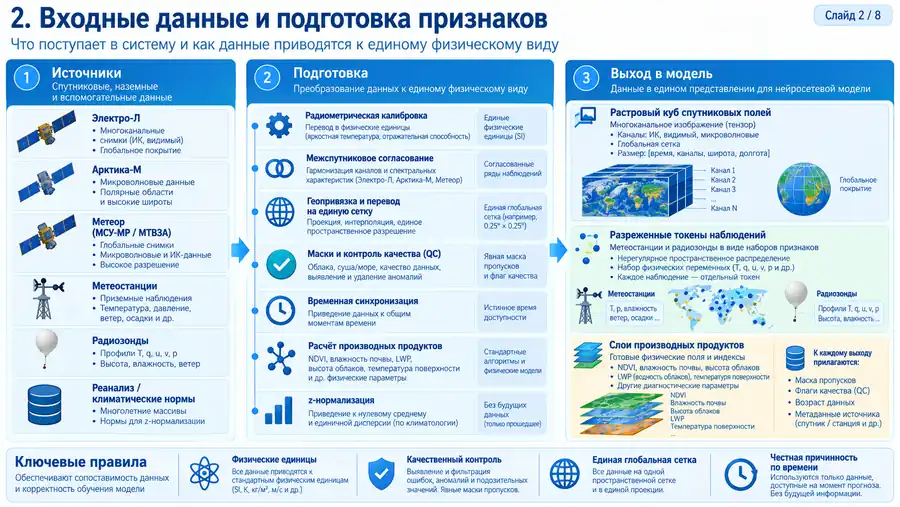
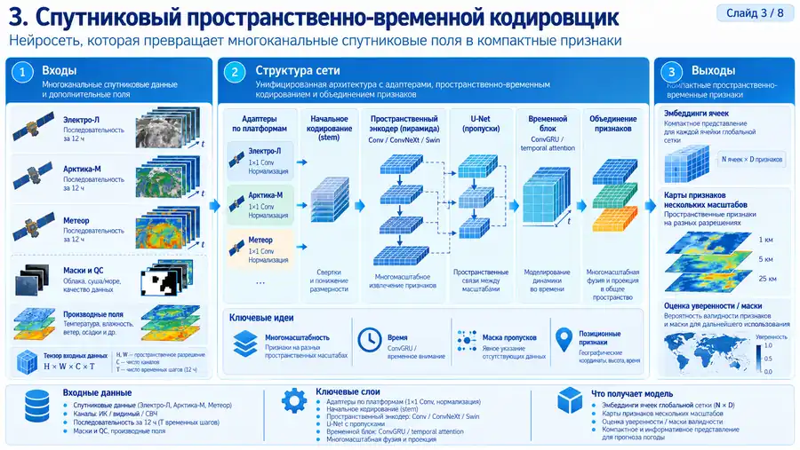
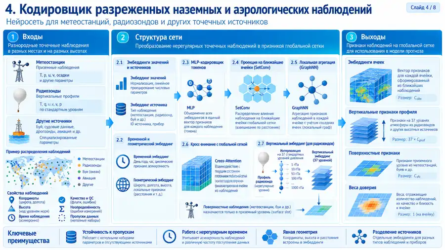
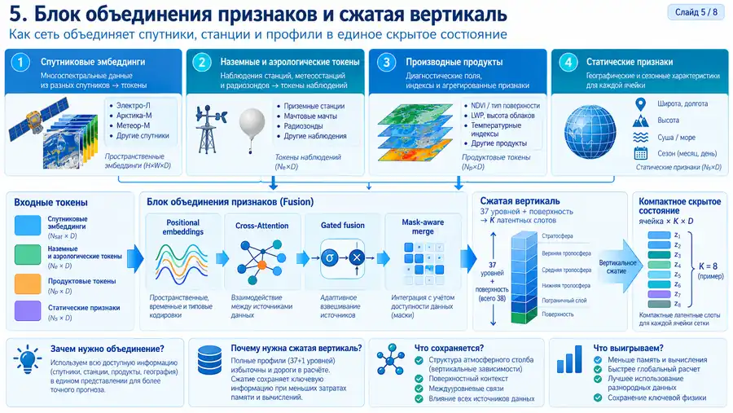
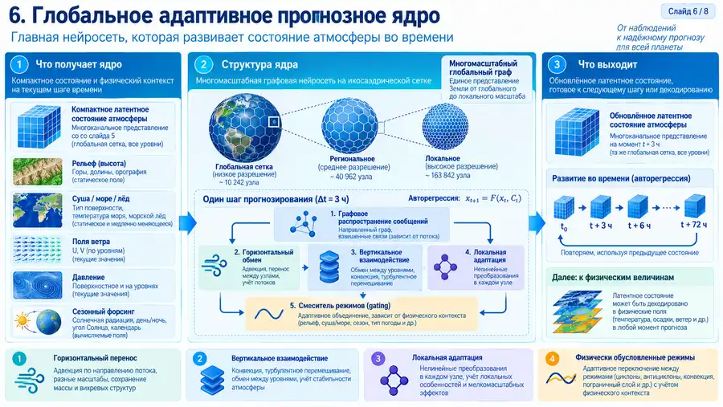
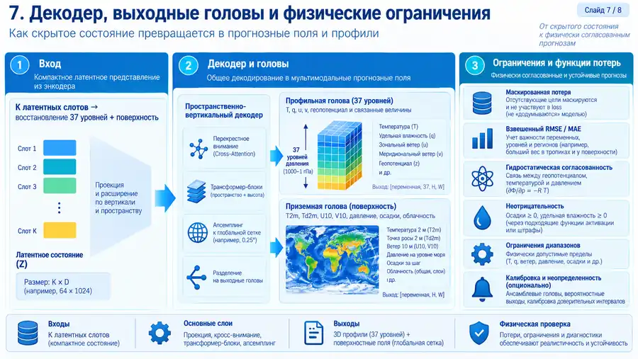
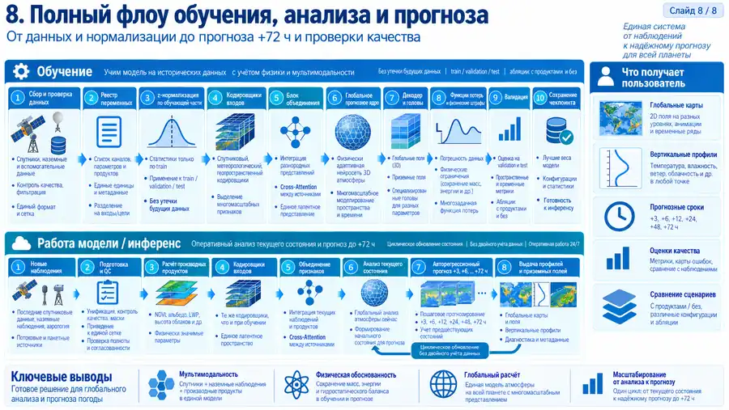

# Визуальная схема архитектуры глобальной модели

Этот документ объясняет систему от общего контура до отдельных нейросетевых блоков.
Он дополняет [архитектуру](ARCHITECTURE.md), [обучение](TRAINING.md) и [спутниковую продукцию](SATELLITE_PRODUCTS.md).

> Иллюстрации являются техническими схемами.
> Они показывают также целевые исследовательские блоки.
> Фактический статус функции определяют код, протоколы и текстовая документация.

## 1. Общая архитектура

Схема связывает источники наблюдений, подготовку, кодировщики, объединение признаков, глобальное ядро и выходные поля.
Это карта всей системы.

## 2. Входные данные и подготовка признаков

Здесь показаны спутники, станции, радиозонды, реанализ и производная продукция.
Перед моделью данные проходят контроль единиц, времени, качества, геометрии и нормализации.

## 3. Спутниковый пространственно-временной кодировщик

Схема показывает целевую структуру для многоканальных последовательностей.
Она включает адаптеры платформ, многомасштабный пространственный кодировщик и временной блок.

Полноценный U-Net или ConvGRU для сырых спутниковых растров остаётся направлением развития.
Текущий код уже принимает физически проверенные каналы и производные признаки.

## 4. Кодировщик разреженных наблюдений

Блок предназначен для станций, радиозондов и других нерегулярных измерений.
Он сохраняет источник, время, геометрию, давление, маску и качество.

## 5. Объединение признаков и сжатая вертикаль

Разнородные признаки формируют единое скрытое состояние.
Полная вертикаль с 37 изобарами и поверхностью сжимается в небольшое число латентных позиций.
По умолчанию используется восемь позиций.

## 6. Глобальное адаптивное прогнозное ядро

Это центральный прогнозный блок.
Он работает на многомасштабном сферическом графе и выполняет последовательные шаги динамики.

Текущая модель использует направленные сообщения и физические признаки состояния.
Она не объявляется полным численным решателем уравнений атмосферы.

## 7. Декодер и выходные головы

Декодер восстанавливает 37 уровней и поверхность из компактного скрытого состояния.
Отдельные головы формируют профильные и приземные величины.

Функции потерь используют маски целей и физические ограничения.
Вероятностные выходы и полный баланс воды и энергии остаются отдельными исследованиями.

## 8. Полный цикл обучения, анализа и прогноза

Верхняя часть схемы показывает обучение на исторических данных.
Нижняя часть показывает рабочий выпуск по фактически доступным наблюдениям.

Будущие фактические наблюдения не подмешиваются в уже начатый прогноз.
Каждый новый срок наблюдений формирует новый анализ.

## Как читать документацию дальше

1. Прочитайте [ARCHITECTURE.md](ARCHITECTURE.md) для точного статуса нейросетевых блоков.
2. Прочитайте [DATA_CONTRACT.md](DATA_CONTRACT.md) для форматов и масок данных.
3. Прочитайте [SATELLITE_PRODUCTS.md](SATELLITE_PRODUCTS.md) для NDVI, влажности почвы и облачной продукции.
4. Прочитайте [TRAINING.md](TRAINING.md) для подготовки выборки, обучения и проверки.
5. Прочитайте [протоколы](protocols/README.md) перед изменением кода или научной постановки.

